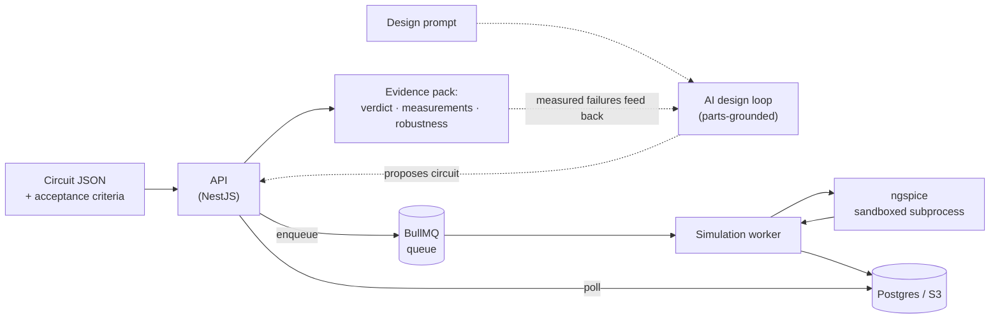

<div align="center">

# ⚡ Circuit Forge

**AI-assisted circuit design, verified by real SPICE.**
Every verdict is backed by measured evidence — never by a model's say-so.

[](https://github.com/Abdulberk/circuit-forge/actions/workflows/ci.yml)
[](https://github.com/Abdulberk/circuit-forge/actions/workflows/pcb-gate.yml)
[](https://github.com/Abdulberk/circuit-forge/releases)
[](https://www.npmjs.com/package/@circuit-forge/eda-core)

[](#-tested-against-real-ngspice--in-ci)


[Quick start](#-quick-start) · [What it does](#-what-it-does) · [Architecture](#%EF%B8%8F-architecture) · [Quality](#-tested-against-real-ngspice--in-ci) · [Docs](#-documentation) · [Status](#%EF%B8%8F-status--roadmap)

</div>

---

Most AI tools *tell* you a circuit works. **Circuit Forge proves it.** A design is only called
**verified** after real **ngspice** simulates it and every stated acceptance criterion is checked
against *measured* values — voltages, branch currents, cutoff frequency, THD, gain. What you get
back is not "looks good": it is an evidence pack.

```jsonc
// POST /generation/verify-design → DesignEvidence (truncated)
{
  "verdict": "pass",
  "summary": "Simulation OK — 3/3 checks passed",
  "assertions": [
    {
      "label": "LED current ≈ 10 mA",
      "probe": "i(R1)", "metric": "final", "op": "approx",
      "target": 0.01, "actual": 0.0091, "pass": true,
      "detail": "final(i(R1)) = 0.0091 ✓ approx 0.01"
    }
    // …every criterion, with the measured value and its signed distance to target
  ],
  "measurements": [ { "node": "@r1[i]", "min": 0.0091, "max": 0.0091, "final": 0.0091 } /* … */ ],
  "robustness": {
    "worstCase": { "componentsCornered": ["R1"], "evaluated": 2, "passed": 2, "passAllCorners": true }
  }
}
```

> **Heads up — this repo is pnpm-only.** Internal packages use the `workspace:*` protocol, which
> `npm install` cannot parse. Always use `pnpm`. See [LOCAL_SETUP.md](LOCAL_SETUP.md).

---

## ✨ What it does

| | Capability |
|---|---|
| 🧠 **AI design loop** | Describe intent → the LLM designs against a **live parts catalog** (real MPNs + sourcing), simulates, reads the measured failures, and self-repairs until the spec is met — or honestly reports why not. |
| ✅ **Deterministic verification** | Circuit JSON → generated SPICE netlist → sandboxed ngspice → typed results → pass/fail per acceptance criterion (`min · max · final · pp · avg · rms · cutoff · thd · gain`). |
| 🎲 **Robustness, not just nominal** | Monte-Carlo yield with confidence interval, worst-case ±tolerance **corner analysis** (2ᵏ extremes), and parametric sweeps — a design that only works at nominal isn't a design. |
| 📈 **Broad analysis coverage** | Operating point, transient, AC, DC sweep, noise, DC sensitivity — plus Fourier/THD, `.meas` measurements, and small-signal transfer function. |
| 🔀 **Mixed-signal** | Digital XSPICE devices (gates, flip-flops, latches, tristate) auto-bridged to the analog domain. |
| 🔁 **SPICE interchange** | Import/export standard SPICE decks (LTspice/KiCad round-trip), analog and digital. |
| 🧩 **Real components** | TME-backed catalog search over 1.3M+ manufacturer parts (stock, pricing, datasheets), E-series (IEC 60063) value snapping, per-version **BOM** export. |
| 🖨️ **PCB pipeline** | Autorouted layout, KiCad-based DRC, Gerber / BOM / pick-and-place export, and a 3D board model (GLB) — as an async job queue. |
| 🏢 **Multi-tenant platform** | Orgs & RBAC, JWT auth, usage metering + quotas, platform-admin API with audit trail, OpenTelemetry observability (opt-in), readiness probes. |

---

## 🏗️ Architecture

The heart of the system is a **closed feedback cycle**: design → simulate → measure → repair.
Untrusted netlists never execute inside the API — simulation happens in a dedicated worker, in a
**sandboxed subprocess** (non-root, resource-limited, no network, hard timeout), so a hostile or
degenerate circuit can burn only its own cage.



Monorepo layout (pnpm + Turborepo):

```
apps/
  api/          NestJS REST API — auth, orgs, projects, simulation, AI generation, parts, usage
  worker-sim/   Simulation worker — sandboxed ngspice, Monte-Carlo / corner / sweep batch runners
  pcb-worker/   PCB worker — layout, DRC, Gerber/BOM/PnP, 3D model jobs
  pcb-viewer/   Dev tool — 3D board preview
packages/
  eda-core/     The EDA brain — circuit model, netlist generation, SPICE sanitization, ERC,
                result parsing, assertions, Monte-Carlo/corner/sweep engines  (MIT)
  llm-core/     AI design loop — parts-grounded tool use, simulate-in-the-loop self-repair
  pcb-core/     PCB contracts — fab profiles, DRC oracle, Gerber/BOM/PnP writers
```

Deep dive — services, queues, sandbox model, graceful shutdown, environment variables:
[docs/ARCHITECTURE.md](docs/ARCHITECTURE.md).

---

## 🔬 Tested against real ngspice — in CI

Unit tests alone are not enough for an EDA tool: the bugs live at the **circuit-to-SPICE
boundary** and in **simulator version drift**. So besides the per-package unit and integration
suites, every PR runs a real-ngspice regression battery:

| Harness | What it locks down |
|---|---|
| **Coverage matrix** — 83 cells | Every device × analysis × probe-form combination, checked against analytic expectations |
| **Edge battery** — 51 cases | Numeric limits, convergence, safety invariants, physics sanity |
| **Pairwise sweep** — 200 combos | Parameter × hostile-name interactions |
| **Seeded fuzz** | Random circuits must fail *loudly* or produce finite data — never silently wrong |

The engine itself is **pinned and drift-guarded**: CI asserts the runner's ngspice major, and a
dedicated job runs the same battery against the **exact Alpine binary production ships** — so an
engine upgrade is an explicit, matrix-verified decision, never a silent change.

---

## 🚀 Quick start

> Verified step-by-step instructions (incl. Windows specifics and port-conflict handling) live in
> **[LOCAL_SETUP.md](LOCAL_SETUP.md)**.

```powershell
pnpm install                                # never `npm install`
docker compose up -d postgres redis minio   # Postgres 5432 / Redis 6379 / MinIO 9000
pnpm db:migrate:dev                         # apply schema (first run creates it)
pnpm db:seed                                # demo data (optional)
pnpm dev                                    # start all apps in watch mode
```

- **API:** http://localhost:3001 · **Swagger:** http://localhost:3001/docs
- **MinIO console:** http://localhost:9001 (`minioadmin` / `minioadmin`)
- **Demo login:** `demo@circuitforge.io` / `demo123456`

**ngspice** (required for actual simulation results):

```powershell
# Windows (Administrator PowerShell)
choco install ngspice -y
# Linux:  sudo apt-get install ngspice     |     macOS:  brew install ngspice
```

<details>
<summary><b>Root scripts</b></summary>

| Script | Purpose |
|---|---|
| `pnpm dev` / `pnpm build` | Watch mode / build all (Turbo) |
| `pnpm test` / `test:cov` / `test:e2e` | Unit + integration suites |
| `pnpm test:matrix` / `test:edge` / `test:sweep` / `test:fuzz` | Real-ngspice regression battery |
| `pnpm test:robustness` | Monte-Carlo/corner current-criteria proof (real ngspice) |
| `pnpm test:layout` | PCB layout + DRC eval harness |
| `pnpm typecheck` / `lint` / `format` | Static checks |
| `pnpm db:migrate` / `db:generate` / `db:seed` / `db:studio` | Database workflows |

</details>

---

## 📚 Documentation

| Doc | Contents |
|---|---|
| [docs/ARCHITECTURE.md](docs/ARCHITECTURE.md) | System design, environment variables, queues, sandbox |
| [docs/API.md](docs/API.md) | Full endpoint reference |
| [docs/EDA_CORE.md](docs/EDA_CORE.md) | Circuit model, netlist generation, analyses |
| [docs/OBSERVABILITY.md](docs/OBSERVABILITY.md) | OpenTelemetry setup (opt-in, inert by default) |
| [VERIFICATION.md](VERIFICATION.md) | What "verified" means here, and how it is enforced |
| [LOCAL_SETUP.md](LOCAL_SETUP.md) | Verified local setup, Windows gotchas |

---

## 🗺️ Status & roadmap

**Current: [v0.1.0](https://github.com/Abdulberk/circuit-forge/releases) (pre-release).** This is
the backend milestone — honest about what it is:

- ✅ Simulation, verification, robustness, AI loop, PCB pipeline, multi-tenant platform — built and tested
- 🚧 Web frontend — in progress (this repo is backend + API today)
- 🚧 Security hardening for hostile multi-tenant traffic — deferred, tracked
- 🚧 Load testing & production deployment — not yet

APIs may change before 1.0.

## 📄 License

[`@circuit-forge/eda-core`](packages/eda-core/LICENSE) is **MIT** and published on
[npm](https://www.npmjs.com/package/@circuit-forge/eda-core) (from this monorepo — see
`packages/eda-core`). The remaining packages and applications are **not yet licensed**
(all rights reserved) while the project is pre-release — licensing will be finalized before 1.0.
