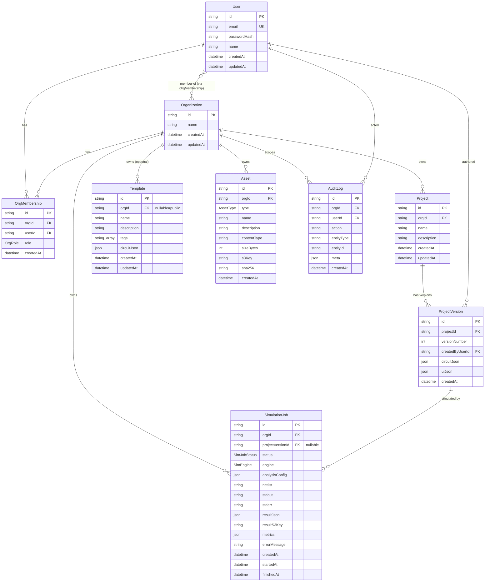

# Circuit Forge — Data Model Reference

This document is the authoritative reference for the Circuit Forge persistence layer. Every statement below is derived directly from the Prisma schema [apps/api/prisma/schema.prisma](../apps/api/prisma/schema.prisma) and confirmed against the generated SQL migration [apps/api/prisma/migrations/20260529111305_init/migration.sql](../apps/api/prisma/migrations/20260529111305_init/migration.sql).

- **Models:** 9 (`User`, `Organization`, `OrgMembership`, `Project`, `ProjectVersion`, `Template`, `Asset`, `SimulationJob`, `AuditLog`)
- **Enums:** 4 (`OrgRole`, `AssetType`, `SimJobStatus`, `SimEngine`)
- **ORM:** Prisma Client JS
- **Database:** PostgreSQL

---

## Datasource & Generator

Defined at the top of [schema.prisma](../apps/api/prisma/schema.prisma):

```prisma
generator client {
  provider = "prisma-client-js"
}

datasource db {
  provider = "postgresql"
  url      = env("DATABASE_URL")
}
```

| Block | Setting | Value |
| --- | --- | --- |
| `generator client` | `provider` | `prisma-client-js` (generates the type-safe Prisma Client used by the API) |
| `datasource db` | `provider` | `postgresql` |
| `datasource db` | `url` | `env("DATABASE_URL")` — read from the environment, not hardcoded |

`DATABASE_URL` is supplied through the environment. Per the project conventions, apps load the monorepo **root** `.env` (the API resolves `['.env.local', '.env', '../../.env']`, and `prisma/seed.ts` self-loads the root `.env`). See [LOCAL_SETUP.md](../LOCAL_SETUP.md).

> Note on physical types: Prisma maps `String` → `TEXT`, `Int` → `INTEGER`, `DateTime` → `TIMESTAMP(3)`, `Json` → `JSONB`, `String[]` → `TEXT[]`, and `Boolean` → `BOOLEAN` for PostgreSQL. The `@db.Text` modifier on `SimulationJob.netlist`/`stdout`/`stderr` is explicit (Prisma already maps `String` to `TEXT` on Postgres, so it documents intent for large content). The migration SQL confirms all of these mappings.

---

## Enums

All four enums are created as native PostgreSQL `ENUM` types in the migration.

### `OrgRole`
Membership role of a user within an organization. Default for a new membership is `MEMBER`.

| Value | Meaning |
| --- | --- |
| `OWNER` | Highest privilege; full control of the org |
| `ADMIN` | Administrative privilege within the org |
| `MEMBER` | Standard member (default) |

### `AssetType`
Classifies an uploaded asset.

| Value | Meaning |
| --- | --- |
| `SPICE_MODEL` | A SPICE device/model file |
| `SYMBOL_PACK` | A pack of schematic symbols |
| `OTHER` | Any other asset type |

### `SimJobStatus`
Lifecycle state of a simulation job. Default for a new job is `QUEUED`.

| Value | Meaning |
| --- | --- |
| `QUEUED` | Created, awaiting a worker (default) |
| `RUNNING` | Picked up and executing |
| `SUCCEEDED` | Completed successfully |
| `FAILED` | Completed with an error |
| `CANCELED` | Canceled by a user/system |
| `TIMED_OUT` | Exceeded its time budget |

### `SimEngine`
Simulation backend. Default for a new job is `NGSPICE`.

| Value | Meaning |
| --- | --- |
| `NGSPICE` | The ngspice engine (the only supported engine). See [docs/SIMULATION.md](SIMULATION.md). |

---

## Models

For each model below: the Prisma model name, its database table name (`@@map`), every scalar/relation field with its Prisma type, nullability, attributes, and the underlying SQL column type from the migration.

### `User` → table `users`

Application user with credentials. Source: [schema.prisma](../apps/api/prisma/schema.prisma).

| Field | Prisma Type | SQL Type | Attributes / Modifiers | Notes |
| --- | --- | --- | --- | --- |
| `id` | `String` | `TEXT` | `@id @default(uuid())` | Primary key, UUID generated by Prisma |
| `email` | `String` | `TEXT` | `@unique` | Unique login email |
| `passwordHash` | `String` | `TEXT` | — | Hashed password (never plaintext) |
| `name` | `String` | `TEXT` | — | Display name |
| `createdAt` | `DateTime` | `TIMESTAMP(3)` | `@default(now())` | Row creation timestamp |
| `updatedAt` | `DateTime` | `TIMESTAMP(3)` | `@updatedAt` | Auto-updated on write |

Relations (outgoing): `memberships OrgMembership[]`, `projectVersions ProjectVersion[]`, `auditLogs AuditLog[]`.

Unique constraints / indexes: `users_email_key` UNIQUE on (`email`).

### `Organization` → table `organizations`

The top-level tenant boundary. Almost all business data is scoped to an organization.

| Field | Prisma Type | SQL Type | Attributes / Modifiers | Notes |
| --- | --- | --- | --- | --- |
| `id` | `String` | `TEXT` | `@id @default(uuid())` | Primary key, UUID |
| `name` | `String` | `TEXT` | — | Organization display name |
| `createdAt` | `DateTime` | `TIMESTAMP(3)` | `@default(now())` | Row creation timestamp |
| `updatedAt` | `DateTime` | `TIMESTAMP(3)` | `@updatedAt` | Auto-updated on write |

Relations (outgoing): `memberships OrgMembership[]`, `projects Project[]`, `templates Template[]`, `assets Asset[]`, `simulationJobs SimulationJob[]`, `auditLogs AuditLog[]`.

### `OrgMembership` → table `org_memberships`

Join entity binding a `User` to an `Organization` with a role. This is the core of the multi-tenant access model.

| Field | Prisma Type | SQL Type | Attributes / Modifiers | Notes |
| --- | --- | --- | --- | --- |
| `id` | `String` | `TEXT` | `@id @default(uuid())` | Primary key, UUID |
| `orgId` | `String` | `TEXT` | FK → `organizations.id` | The organization |
| `userId` | `String` | `TEXT` | FK → `users.id` | The user |
| `role` | `OrgRole` | `"OrgRole"` | `@default(MEMBER)` | Member's role within the org |
| `createdAt` | `DateTime` | `TIMESTAMP(3)` | `@default(now())` | Row creation timestamp |

Relations:
- `org Organization @relation(fields: [orgId], references: [id], onDelete: Cascade)`
- `user User @relation(fields: [userId], references: [id], onDelete: Cascade)`

Constraints / indexes:
- `@@unique([orgId, userId])` → `org_memberships_orgId_userId_key` (a user can belong to a given org at most once).
- FK `org_memberships_orgId_fkey` ON DELETE CASCADE.
- FK `org_memberships_userId_fkey` ON DELETE CASCADE.

### `Project` → table `projects`

A circuit-design project owned by one organization.

| Field | Prisma Type | SQL Type | Attributes / Modifiers | Notes |
| --- | --- | --- | --- | --- |
| `id` | `String` | `TEXT` | `@id @default(uuid())` | Primary key, UUID |
| `orgId` | `String` | `TEXT` | FK → `organizations.id` | Owning organization |
| `name` | `String` | `TEXT` | — | Project name (unique within the org) |
| `description` | `String?` | `TEXT` (nullable) | — | Optional description |
| `createdAt` | `DateTime` | `TIMESTAMP(3)` | `@default(now())` | Row creation timestamp |
| `updatedAt` | `DateTime` | `TIMESTAMP(3)` | `@updatedAt` | Auto-updated on write |

Relations:
- `org Organization @relation(fields: [orgId], references: [id], onDelete: Cascade)`
- `versions ProjectVersion[]`

Constraints / indexes:
- `@@unique([orgId, name])` → `projects_orgId_name_key` (project names are unique per org).
- FK `projects_orgId_fkey` ON DELETE CASCADE.

### `ProjectVersion` → table `project_versions`

An immutable snapshot of a project's circuit at a given version number. **Stores the canonical circuit JSON and UI/layout JSON.**

| Field | Prisma Type | SQL Type | Attributes / Modifiers | Notes |
| --- | --- | --- | --- | --- |
| `id` | `String` | `TEXT` | `@id @default(uuid())` | Primary key, UUID |
| `projectId` | `String` | `TEXT` | FK → `projects.id` | Parent project |
| `versionNumber` | `Int` | `INTEGER` | — | Monotonic version number within the project |
| `createdByUserId` | `String` | `TEXT` | FK → `users.id` | Author of this version |
| `circuitJson` | `Json` | `JSONB` | — | **Canonical circuit representation** (components, nets, etc.) |
| `uiJson` | `Json` | `JSONB` | — | **Layout / UI editor state** |
| `createdAt` | `DateTime` | `TIMESTAMP(3)` | `@default(now())` | Row creation timestamp |

Relations:
- `project Project @relation(fields: [projectId], references: [id], onDelete: Cascade)`
- `createdBy User @relation(fields: [createdByUserId], references: [id])` — DB-level `ON DELETE RESTRICT` (a user who authored a version cannot be hard-deleted while versions reference them).
- `simulationJobs SimulationJob[]`

Constraints / indexes:
- `@@unique([projectId, versionNumber])` → `project_versions_projectId_versionNumber_key` (version numbers are unique per project).
- FK `project_versions_projectId_fkey` ON DELETE CASCADE.
- FK `project_versions_createdByUserId_fkey` ON DELETE RESTRICT.

### `Template` → table `templates`

A reusable starter circuit. **Stores circuit JSON.** Can be **public** (org-less) or org-scoped.

| Field | Prisma Type | SQL Type | Attributes / Modifiers | Notes |
| --- | --- | --- | --- | --- |
| `id` | `String` | `TEXT` | `@id @default(uuid())` | Primary key, UUID |
| `orgId` | `String?` | `TEXT` (nullable) | FK → `organizations.id` | `null` = public template (visible to all) |
| `name` | `String` | `TEXT` | — | Template name |
| `description` | `String?` | `TEXT` (nullable) | — | Optional description |
| `tags` | `String[]` | `TEXT[]` | — | Free-form tags array |
| `circuitJson` | `Json` | `JSONB` | — | **Circuit definition for the template** |
| `createdAt` | `DateTime` | `TIMESTAMP(3)` | `@default(now())` | Row creation timestamp |
| `updatedAt` | `DateTime` | `TIMESTAMP(3)` | `@updatedAt` | Auto-updated on write |

Relations:
- `org Organization? @relation(fields: [orgId], references: [id], onDelete: Cascade)` — optional relation; `orgId` nullable means a template can be unscoped/public.

Constraints / indexes: FK `templates_orgId_fkey` ON DELETE CASCADE. (No `@@unique`/`@@index` declared.)

> The demo seed creates 5 templates. See the seed script referenced in [LOCAL_SETUP.md](../LOCAL_SETUP.md).

### `Asset` → table `assets`

Org-scoped binary asset (SPICE models, symbol packs, etc.) stored in object storage (S3/MinIO) with a DB row of metadata.

| Field | Prisma Type | SQL Type | Attributes / Modifiers | Notes |
| --- | --- | --- | --- | --- |
| `id` | `String` | `TEXT` | `@id @default(uuid())` | Primary key, UUID |
| `orgId` | `String` | `TEXT` | FK → `organizations.id` | Owning organization |
| `type` | `AssetType` | `"AssetType"` | — | Asset classification |
| `name` | `String` | `TEXT` | — | Asset name |
| `description` | `String?` | `TEXT` (nullable) | — | Optional description |
| `contentType` | `String` | `TEXT` | — | MIME content type |
| `sizeBytes` | `Int` | `INTEGER` | — | Size in bytes |
| `s3Key` | `String` | `TEXT` | — | Object storage key (S3/MinIO) |
| `sha256` | `String` | `TEXT` | — | Content hash for integrity/dedup |
| `createdAt` | `DateTime` | `TIMESTAMP(3)` | `@default(now())` | Row creation timestamp |

Relations:
- `org Organization @relation(fields: [orgId], references: [id], onDelete: Cascade)`

Constraints / indexes: FK `assets_orgId_fkey` ON DELETE CASCADE. (No `@@unique`/`@@index` declared.)

> The actual bytes live in object storage (MinIO locally — console at http://localhost:9001). This table holds only the pointer (`s3Key`) and metadata.

### `SimulationJob` → table `simulation_jobs`

A queued/executed simulation run. **Stores both the input netlist and the simulation results** (inline JSON and/or an object-storage key). See [docs/SIMULATION.md](SIMULATION.md).

| Field | Prisma Type | SQL Type | Attributes / Modifiers | Notes |
| --- | --- | --- | --- | --- |
| `id` | `String` | `TEXT` | `@id @default(uuid())` | Primary key, UUID |
| `orgId` | `String` | `TEXT` | FK → `organizations.id` | Owning organization |
| `projectVersionId` | `String?` | `TEXT` (nullable) | FK → `project_versions.id` | Source version (nullable; SET NULL on delete) |
| `status` | `SimJobStatus` | `"SimJobStatus"` | `@default(QUEUED)` | Job lifecycle state |
| `engine` | `SimEngine` | `"SimEngine"` | `@default(NGSPICE)` | Simulation engine |
| `analysisConfig` | `Json` | `JSONB` | — | Analysis parameters (e.g. transient/DC/AC config) |
| `netlist` | `String` | `TEXT` | `@db.Text` | **Input SPICE netlist** |
| `stdout` | `String?` | `TEXT` (nullable) | `@db.Text` | Engine stdout |
| `stderr` | `String?` | `TEXT` (nullable) | `@db.Text` | Engine stderr |
| `resultJson` | `Json?` | `JSONB` (nullable) | — | **Inline simulation results** |
| `resultS3Key` | `String?` | `TEXT` (nullable) | — | **Object-storage key for large result payloads** (e.g. CSV waveforms) |
| `metrics` | `Json?` | `JSONB` (nullable) | — | `{ runtimeMs, peakMemBytes, pointsCount }` |
| `errorMessage` | `String?` | `TEXT` (nullable) | — | Human-readable failure reason |
| `createdAt` | `DateTime` | `TIMESTAMP(3)` | `@default(now())` | Enqueue timestamp |
| `startedAt` | `DateTime?` | `TIMESTAMP(3)` (nullable) | — | When execution began |
| `finishedAt` | `DateTime?` | `TIMESTAMP(3)` (nullable) | — | When execution ended |

Relations:
- `org Organization @relation(fields: [orgId], references: [id], onDelete: Cascade)`
- `projectVersion ProjectVersion? @relation(fields: [projectVersionId], references: [id], onDelete: SetNull)` — optional; if the version is deleted, the job is retained with `projectVersionId` nulled.

Constraints / indexes:
- `@@index([orgId, createdAt])` → `simulation_jobs_orgId_createdAt_idx` (org job history listing).
- `@@index([status])` → `simulation_jobs_status_idx` (worker polling by status).
- FK `simulation_jobs_orgId_fkey` ON DELETE CASCADE.
- FK `simulation_jobs_projectVersionId_fkey` ON DELETE SET NULL.

### `AuditLog` → table `audit_logs`

Append-only record of significant actions, scoped to an org and attributed to a user.

| Field | Prisma Type | SQL Type | Attributes / Modifiers | Notes |
| --- | --- | --- | --- | --- |
| `id` | `String` | `TEXT` | `@id @default(uuid())` | Primary key, UUID |
| `orgId` | `String` | `TEXT` | FK → `organizations.id` | Org the action occurred in |
| `userId` | `String` | `TEXT` | FK → `users.id` | Acting user |
| `action` | `String` | `TEXT` | — | e.g. `"project.create"`, `"simulation.start"` |
| `entityType` | `String` | `TEXT` | — | e.g. `"Project"`, `"SimulationJob"` |
| `entityId` | `String` | `TEXT` | — | Target entity id |
| `meta` | `Json?` | `JSONB` (nullable) | — | Additional context |
| `createdAt` | `DateTime` | `TIMESTAMP(3)` | `@default(now())` | Row creation timestamp |

Relations:
- `org Organization @relation(fields: [orgId], references: [id], onDelete: Cascade)`
- `user User @relation(fields: [userId], references: [id])` — DB-level `ON DELETE RESTRICT`.

Constraints / indexes:
- `@@index([orgId, createdAt])` → `audit_logs_orgId_createdAt_idx` (per-org audit timeline).
- `@@index([entityType, entityId])` → `audit_logs_entityType_entityId_idx` (per-entity history).
- FK `audit_logs_orgId_fkey` ON DELETE CASCADE.
- FK `audit_logs_userId_fkey` ON DELETE RESTRICT.

---

## Relations & Cardinality

All foreign keys, their referenced columns, and on-delete behavior are taken from the migration's `AddForeignKey` statements.

| From (FK holder) | Field | → To | Cardinality | FK column → references | On Delete |
| --- | --- | --- | --- | --- | --- |
| `OrgMembership` | `org` | `Organization` | many-to-1 | `orgId` → `organizations.id` | CASCADE |
| `OrgMembership` | `user` | `User` | many-to-1 | `userId` → `users.id` | CASCADE |
| `Project` | `org` | `Organization` | many-to-1 | `orgId` → `organizations.id` | CASCADE |
| `ProjectVersion` | `project` | `Project` | many-to-1 | `projectId` → `projects.id` | CASCADE |
| `ProjectVersion` | `createdBy` | `User` | many-to-1 | `createdByUserId` → `users.id` | RESTRICT |
| `Template` | `org` | `Organization` | many-to-1 (optional) | `orgId` → `organizations.id` (nullable) | CASCADE |
| `Asset` | `org` | `Organization` | many-to-1 | `orgId` → `organizations.id` | CASCADE |
| `SimulationJob` | `org` | `Organization` | many-to-1 | `orgId` → `organizations.id` | CASCADE |
| `SimulationJob` | `projectVersion` | `ProjectVersion` | many-to-1 (optional) | `projectVersionId` → `project_versions.id` (nullable) | SET NULL |
| `AuditLog` | `org` | `Organization` | many-to-1 | `orgId` → `organizations.id` | CASCADE |
| `AuditLog` | `user` | `User` | many-to-1 | `userId` → `users.id` | RESTRICT |

### Many-to-many: User ↔ Organization

`User` and `Organization` form a **many-to-many** relationship realized through the explicit join model `OrgMembership` (which additionally carries a `role`). The `@@unique([orgId, userId])` constraint enforces at most one membership row per (org, user) pair.

### One-to-many summaries

- `Organization` 1—many `OrgMembership`, `Project`, `Template`, `Asset`, `SimulationJob`, `AuditLog`.
- `User` 1—many `OrgMembership`, `ProjectVersion` (as author), `AuditLog` (as actor).
- `Project` 1—many `ProjectVersion`.
- `ProjectVersion` 1—many `SimulationJob`.

There are no 1-to-1 relations in this schema.

---

## Multi-Tenant Design

Circuit Forge is **org-scoped multi-tenancy** with a shared schema (single set of tables; rows partitioned by `orgId`).

1. **Tenant boundary = `Organization`.** Every business entity that holds data — `Project`, `Template` (optionally), `Asset`, `SimulationJob`, `AuditLog` — carries an `orgId` foreign key to `organizations.id`. `ProjectVersion` inherits its org indirectly through its parent `Project`.

2. **Membership & roles.** A `User` is not directly attached to an org. Instead, the `OrgMembership` join table links a user to an org and assigns an `OrgRole` (`OWNER` / `ADMIN` / `MEMBER`, default `MEMBER`). The `@@unique([orgId, userId])` constraint guarantees a single membership per user per org. A user can be a member of multiple orgs, and an org can have many users — the many-to-many relationship described above.

3. **Cascade isolation.** Deleting an `Organization` cascades to all of its memberships, projects (and their versions), templates, assets, simulation jobs, and audit logs (`ON DELETE CASCADE` on every `orgId` FK). This makes tenant data removal atomic at the org level.

4. **Referential safety for attribution.** `ProjectVersion.createdByUserId` and `AuditLog.userId` use `ON DELETE RESTRICT`, so a user that authored a version or generated audit history cannot be hard-deleted out from under those records, preserving authorship/audit integrity.

5. **Public vs. private templates.** `Template.orgId` is nullable: a `null` org means a **public template** available across tenants, while a non-null `orgId` scopes the template to a single org.

6. **Soft references for jobs.** `SimulationJob.projectVersionId` is nullable with `ON DELETE SET NULL`, so historical job records (including their netlist/results/metrics) survive deletion of the originating project version.

Application-level enforcement (which queries filter by the caller's org, how roles gate actions) lives in the API; see [docs/SECURITY.md](SECURITY.md) and [docs/API.md](API.md). This document covers only what the schema/migration guarantees at the data layer.

---

## Where Circuit JSON & Simulation Results Are Stored

| Data | Table.Column | Type | Notes |
| --- | --- | --- | --- |
| Canonical circuit (per version) | `project_versions.circuitJson` | `JSONB` | The authoritative circuit graph for a `ProjectVersion`. |
| Editor / layout state | `project_versions.uiJson` | `JSONB` | UI positioning and view state, kept alongside the circuit. |
| Template circuit | `templates.circuitJson` | `JSONB` | Reusable starter circuit definition. |
| Simulation input netlist | `simulation_jobs.netlist` | `TEXT` (`@db.Text`) | The SPICE netlist fed to the engine. |
| Simulation analysis config | `simulation_jobs.analysisConfig` | `JSONB` | Analysis parameters for the run. |
| Simulation results (inline) | `simulation_jobs.resultJson` | `JSONB` (nullable) | Result payload stored directly in the DB. |
| Simulation results (object store) | `simulation_jobs.resultS3Key` | `TEXT` (nullable) | Pointer to a large result file (e.g. CSV waveforms) in S3/MinIO. |
| Simulation engine logs | `simulation_jobs.stdout` / `stderr` | `TEXT` (nullable) | Raw engine output. |
| Simulation metrics | `simulation_jobs.metrics` | `JSONB` (nullable) | `{ runtimeMs, peakMemBytes, pointsCount }`. |

In short: **circuit JSON** lives in `project_versions` (`circuitJson`, `uiJson`) and `templates` (`circuitJson`); **simulation input and results** live in `simulation_jobs` (`netlist`, `analysisConfig`, `resultJson`, `resultS3Key`, `metrics`, plus `stdout`/`stderr`).

---

## Entity-Relationship Diagram



---

## Index of Mapped Table Names

| Prisma Model | DB Table (`@@map`) |
| --- | --- |
| `User` | `users` |
| `Organization` | `organizations` |
| `OrgMembership` | `org_memberships` |
| `Project` | `projects` |
| `ProjectVersion` | `project_versions` |
| `Template` | `templates` |
| `Asset` | `assets` |
| `SimulationJob` | `simulation_jobs` |
| `AuditLog` | `audit_logs` |

---

## See also

- [README.md](../README.md)
- [docs/ARCHITECTURE.md](ARCHITECTURE.md)
- [docs/API.md](API.md)
- [docs/DATA_MODEL.md](DATA_MODEL.md)
- [docs/EDA_CORE.md](EDA_CORE.md)
- [docs/SIMULATION.md](SIMULATION.md)
- [docs/SECURITY.md](SECURITY.md)
- [LOCAL_SETUP.md](../LOCAL_SETUP.md)
