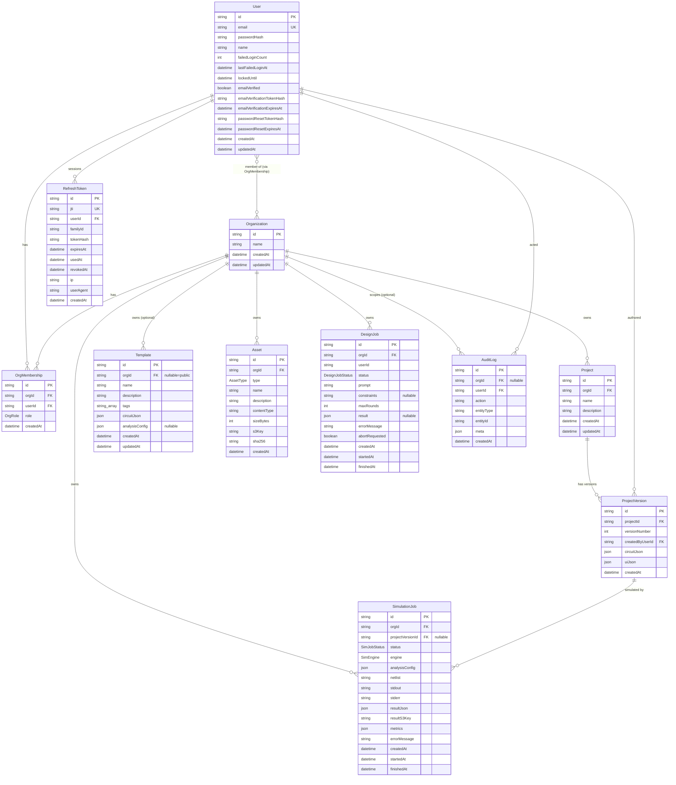

# Circuit Forge — Data Model Reference

This document is the authoritative reference for the Circuit Forge persistence layer. Every statement below is derived directly from the Prisma schema [apps/api/prisma/schema.prisma](../apps/api/prisma/schema.prisma) and confirmed against the generated SQL migrations — see [Migrations](#migrations) below for the full list.

- **Models:** 12 (`User`, `RefreshToken`, `Organization`, `OrgMembership`, `Project`, `ProjectVersion`, `Template`, `Asset`, `SimulationJob`, `DesignJob`, `AuditLog`, `UsageRecord`)
- **Enums:** 5 (`OrgRole`, `AssetType`, `SimJobStatus`, `SimEngine`, `DesignJobStatus`)
- **ORM:** Prisma Client JS
- **Database:** PostgreSQL

---

## Datasource & Generator

Defined at the top of [schema.prisma](../apps/api/prisma/schema.prisma):

```prisma
generator client {
  provider = "prisma-client-js"
}

datasource db {
  provider = "postgresql"
  url      = env("DATABASE_URL")
}
```

| Block | Setting | Value |
| --- | --- | --- |
| `generator client` | `provider` | `prisma-client-js` (generates the type-safe Prisma Client used by the API) |
| `datasource db` | `provider` | `postgresql` |
| `datasource db` | `url` | `env("DATABASE_URL")` — read from the environment, not hardcoded |

`DATABASE_URL` is supplied through the environment. Per the project conventions, apps load the monorepo **root** `.env` (the API resolves `['.env.local', '.env', '../../.env']`, and `prisma/seed.ts` self-loads the root `.env`). See [LOCAL_SETUP.md](../LOCAL_SETUP.md).

> Note on physical types: Prisma maps `String` → `TEXT`, `Int` → `INTEGER`, `DateTime` → `TIMESTAMP(3)`, `Json` → `JSONB`, `String[]` → `TEXT[]`, and `Boolean` → `BOOLEAN` for PostgreSQL. The `@db.Text` modifier on `SimulationJob.netlist`/`stdout`/`stderr`/`DesignJob.prompt`/`constraints` is explicit (Prisma already maps `String` to `TEXT` on Postgres, so it documents intent for large content). The migration SQL confirms all of these mappings.

---

## Migrations

The schema was not created by a single migration. [apps/api/prisma/migrations/](../apps/api/prisma/migrations/) contains, in order:

| Migration | Adds |
| --- | --- |
| `20260529111305_init` | The original 9-model schema (`User` … `AuditLog`, no lifecycle/refresh/design-job fields). |
| `20260610072208_template_analysis_config` | `Template.analysisConfig` (optional `Json`). |
| `20260611085602_usage_records` / `20260611110701_usage_tune` | `UsageRecord` model + a follow-up tuning migration. |
| `20260611171928_auth_lockout_fields` | `User.failedLoginCount` / `lastFailedLoginAt` / `lockedUntil` (brute-force lockout). |
| `20260612062805_auth_account_lifecycle` | `User.emailVerified` + email-verification and password-reset token-hash/expiry fields. |
| `20260612064352_refresh_rotation_audit` | `RefreshToken` model (refresh-token rotation with reuse detection) + makes `AuditLog.orgId` nullable (user-scoped events) + a `[userId, createdAt]` audit index. |
| `20260612070536_audit_user_cascade` | Changes `AuditLog.userId`'s FK to `ON DELETE CASCADE` (was `RESTRICT`). |
| `20260616123329_design_jobs` | `DesignJob` model + `DesignJobStatus` enum (async AI design loop). |
| `20260702091745_platform_admin` | `User.platformRole` + `PlatformRole` enum + `OrgQuotaOverride` model (the cross-tenant operator surface). |
| `20260707120000_layout_jobs` | `LayoutJob` model + `LayoutJobStatus` enum (the PCB layout LRO). |
| `20260710120000_audit_org_setnull` | Changes `AuditLog.orgId`'s FK to `ON DELETE SET NULL` — an audit record must OUTLIVE the org it describes, so deleting a tenant cannot erase the history of what was done to it. |
| `20260715103814_layout_version_linkage` | `LayoutJob.projectId` / `versionId` (both `SetNull`), so a layout survives a page reload and can be listed per project/version. |
| `20260715114407_project_working_copy` | `ProjectWorkingCopy` model (editor autosave drafts). |
| `20260715192402_org_invitations` | `OrgInvitation` model + `OrgInvitationStatus` enum (self-serve membership). |

---

## Enums

All five enums are created as native PostgreSQL `ENUM` types in the migrations.

### `OrgRole`
Membership role of a user within an organization. Default for a new membership is `MEMBER`.

| Value | Meaning |
| --- | --- |
| `OWNER` | Highest privilege; full control of the org |
| `ADMIN` | Administrative privilege within the org |
| `MEMBER` | Standard member (default) |

### `AssetType`
Classifies an uploaded asset.

| Value | Meaning |
| --- | --- |
| `SPICE_MODEL` | A SPICE device/model file |
| `SYMBOL_PACK` | A pack of schematic symbols |
| `OTHER` | Any other asset type |

### `SimJobStatus`
Lifecycle state of a simulation job. Default for a new job is `QUEUED`.

| Value | Meaning |
| --- | --- |
| `QUEUED` | Created, awaiting a worker (default) |
| `RUNNING` | Picked up and executing |
| `SUCCEEDED` | Completed successfully |
| `FAILED` | Completed with an error |
| `CANCELED` | Canceled by a user/system |
| `TIMED_OUT` | Exceeded its time budget |

### `SimEngine`
Simulation backend. Default for a new job is `NGSPICE`.

| Value | Meaning |
| --- | --- |
| `NGSPICE` | The ngspice engine (the only supported engine). See [docs/SIMULATION.md](SIMULATION.md). |

### `DesignJobStatus`
Lifecycle state of an async AI design job (`DesignJob`). Default for a new job is `QUEUED`.

| Value | Meaning |
| --- | --- |
| `QUEUED` | Created, awaiting the design loop to pick it up (default) |
| `RUNNING` | The generate → simulate → fix loop is executing |
| `SUCCEEDED` | Loop finished; `result` holds the full design() payload |
| `FAILED` | Loop finished with an error; `errorMessage` set |
| `CANCELED` | Canceled via `abortRequested` |

---

### `LayoutJobStatus`

`QUEUED` → `RUNNING` → `SUCCEEDED` | `FAILED` | `CANCELED`. Same lifecycle as the simulation and design
queues. Note that **`SUCCEEDED` does not mean the board is manufacturable** — it means the analysis
completed. A board KiCad rejected also lands `SUCCEEDED`, with the verdict inside `result` and no
`gerbersKey`.

### `OrgInvitationStatus`

`PENDING` | `ACCEPTED` | `REVOKED` | `EXPIRED`.

### `PlatformRole`

`NONE` < `SUPPORT` < `OPERATOR` < `ADMIN` — the **second, independent** role axis on `User`. Tenant roles
(`OrgRole`) say what you may do inside an org; this says what you may do ACROSS orgs, and it is what gates
every `/admin/*` route. Read live from the database on each request, so revoking it takes effect
immediately rather than when a JWT expires.

## Models

For each model below: the Prisma model name, its database table name (`@@map`), every scalar/relation field with its Prisma type, nullability, attributes, and the underlying SQL column type from the migration.

### `User` → table `users`

Application user with credentials. Source: [schema.prisma](../apps/api/prisma/schema.prisma).

| Field | Prisma Type | SQL Type | Attributes / Modifiers | Notes |
| --- | --- | --- | --- | --- |
| `id` | `String` | `TEXT` | `@id @default(uuid())` | Primary key, UUID generated by Prisma |
| `email` | `String` | `TEXT` | `@unique` | Unique login email |
| `passwordHash` | `String` | `TEXT` | — | Hashed password (never plaintext) |
| `name` | `String` | `TEXT` | — | Display name |
| `createdAt` | `DateTime` | `TIMESTAMP(3)` | `@default(now())` | Row creation timestamp |
| `updatedAt` | `DateTime` | `TIMESTAMP(3)` | `@updatedAt` | Auto-updated on write |
| `failedLoginCount` | `Int` | `INTEGER` | `@default(0)` | Brute-force lockout counter; resets on a successful login |
| `lastFailedLoginAt` | `DateTime?` | `TIMESTAMP(3)` (nullable) | — | Timestamp of the most recent failed login |
| `lockedUntil` | `DateTime?` | `TIMESTAMP(3)` (nullable) | — | While set and in the future, login is gated (5 fails → 15min lockout) |
| `emailVerified` | `Boolean` | `BOOLEAN` | `@default(false)` | Gates verified-only features (opt-in) |
| `emailVerificationTokenHash` | `String?` | `TEXT` (nullable) | — | sha256 hash of the emailed verification token (raw token never stored) |
| `emailVerificationExpiresAt` | `DateTime?` | `TIMESTAMP(3)` (nullable) | — | Expiry of the pending email-verification token |
| `passwordResetTokenHash` | `String?` | `TEXT` (nullable) | — | sha256 hash of the emailed password-reset token |
| `passwordResetExpiresAt` | `DateTime?` | `TIMESTAMP(3)` (nullable) | — | Expiry of the pending password-reset token |

Relations (outgoing): `memberships OrgMembership[]`, `projectVersions ProjectVersion[]`, `auditLogs AuditLog[]`, `refreshTokens RefreshToken[]`.

Unique constraints / indexes: `users_email_key` UNIQUE on (`email`).

### `RefreshToken` → table `refresh_tokens`

Server-side state for refresh-token rotation. Every issued refresh JWT has a row here, keyed by its `jti`. Rotation marks the old row `usedAt` and issues a successor in the same `familyId` (one family per login/device); reuse of an already-used token is theft evidence and revokes the whole family. Raw tokens are never stored — lookup is by `jti` plus a `tokenHash` check.

| Field | Prisma Type | SQL Type | Attributes / Modifiers | Notes |
| --- | --- | --- | --- | --- |
| `id` | `String` | `TEXT` | `@id @default(uuid())` | Primary key, UUID |
| `jti` | `String` | `TEXT` | `@unique` | JWT ID of the issued refresh token |
| `userId` | `String` | `TEXT` | FK → `users.id` | Owning user |
| `familyId` | `String` | `TEXT` | — | Groups rotated tokens from one login/device |
| `tokenHash` | `String` | `TEXT` | — | Hash of the raw token (never stored in plaintext) |
| `expiresAt` | `DateTime` | `TIMESTAMP(3)` | — | Token expiry |
| `usedAt` | `DateTime?` | `TIMESTAMP(3)` (nullable) | — | Set when rotated (successor issued) |
| `revokedAt` | `DateTime?` | `TIMESTAMP(3)` (nullable) | — | Set by logout or reuse detection |
| `ip` | `String?` | `TEXT` (nullable) | — | Session metadata (device management later) |
| `userAgent` | `String?` | `TEXT` (nullable) | — | Session metadata |
| `createdAt` | `DateTime` | `TIMESTAMP(3)` | `@default(now())` | Row creation timestamp |

Relations: `user User @relation(fields: [userId], references: [id], onDelete: Cascade)`.

Constraints / indexes: `@@index([userId])`, `@@index([familyId])`, FK `refresh_tokens_userId_fkey` ON DELETE CASCADE.

### `Organization` → table `organizations`

The top-level tenant boundary. Almost all business data is scoped to an organization.

| Field | Prisma Type | SQL Type | Attributes / Modifiers | Notes |
| --- | --- | --- | --- | --- |
| `id` | `String` | `TEXT` | `@id @default(uuid())` | Primary key, UUID |
| `name` | `String` | `TEXT` | — | Organization display name |
| `createdAt` | `DateTime` | `TIMESTAMP(3)` | `@default(now())` | Row creation timestamp |
| `updatedAt` | `DateTime` | `TIMESTAMP(3)` | `@updatedAt` | Auto-updated on write |

Relations (outgoing): `memberships OrgMembership[]`, `projects Project[]`, `templates Template[]`, `assets Asset[]`, `simulationJobs SimulationJob[]`, `designJobs DesignJob[]`, `auditLogs AuditLog[]`.

### `OrgMembership` → table `org_memberships`

Join entity binding a `User` to an `Organization` with a role. This is the core of the multi-tenant access model.

| Field | Prisma Type | SQL Type | Attributes / Modifiers | Notes |
| --- | --- | --- | --- | --- |
| `id` | `String` | `TEXT` | `@id @default(uuid())` | Primary key, UUID |
| `orgId` | `String` | `TEXT` | FK → `organizations.id` | The organization |
| `userId` | `String` | `TEXT` | FK → `users.id` | The user |
| `role` | `OrgRole` | `"OrgRole"` | `@default(MEMBER)` | Member's role within the org |
| `createdAt` | `DateTime` | `TIMESTAMP(3)` | `@default(now())` | Row creation timestamp |

Relations:
- `org Organization @relation(fields: [orgId], references: [id], onDelete: Cascade)`
- `user User @relation(fields: [userId], references: [id], onDelete: Cascade)`

Constraints / indexes:
- `@@unique([orgId, userId])` → `org_memberships_orgId_userId_key` (a user can belong to a given org at most once).
- FK `org_memberships_orgId_fkey` ON DELETE CASCADE.
- FK `org_memberships_userId_fkey` ON DELETE CASCADE.

### `Project` → table `projects`

A circuit-design project owned by one organization.

| Field | Prisma Type | SQL Type | Attributes / Modifiers | Notes |
| --- | --- | --- | --- | --- |
| `id` | `String` | `TEXT` | `@id @default(uuid())` | Primary key, UUID |
| `orgId` | `String` | `TEXT` | FK → `organizations.id` | Owning organization |
| `name` | `String` | `TEXT` | — | Project name (unique within the org) |
| `description` | `String?` | `TEXT` (nullable) | — | Optional description |
| `createdAt` | `DateTime` | `TIMESTAMP(3)` | `@default(now())` | Row creation timestamp |
| `updatedAt` | `DateTime` | `TIMESTAMP(3)` | `@updatedAt` | Auto-updated on write |

Relations:
- `org Organization @relation(fields: [orgId], references: [id], onDelete: Cascade)`
- `versions ProjectVersion[]`

Constraints / indexes:
- `@@unique([orgId, name])` → `projects_orgId_name_key` (project names are unique per org).
- FK `projects_orgId_fkey` ON DELETE CASCADE.

### `ProjectVersion` → table `project_versions`

An immutable snapshot of a project's circuit at a given version number. **Stores the canonical circuit JSON and UI/layout JSON.**

| Field | Prisma Type | SQL Type | Attributes / Modifiers | Notes |
| --- | --- | --- | --- | --- |
| `id` | `String` | `TEXT` | `@id @default(uuid())` | Primary key, UUID |
| `projectId` | `String` | `TEXT` | FK → `projects.id` | Parent project |
| `versionNumber` | `Int` | `INTEGER` | — | Monotonic version number within the project |
| `createdByUserId` | `String` | `TEXT` | FK → `users.id` | Author of this version |
| `circuitJson` | `Json` | `JSONB` | — | **Canonical circuit representation** (components, nets, etc.) |
| `uiJson` | `Json` | `JSONB` | — | **Layout / UI editor state** |
| `createdAt` | `DateTime` | `TIMESTAMP(3)` | `@default(now())` | Row creation timestamp |

Relations:
- `project Project @relation(fields: [projectId], references: [id], onDelete: Cascade)`
- `createdBy User @relation(fields: [createdByUserId], references: [id])` — DB-level `ON DELETE RESTRICT` (a user who authored a version cannot be hard-deleted while versions reference them).
- `simulationJobs SimulationJob[]`

Constraints / indexes:
- `@@unique([projectId, versionNumber])` → `project_versions_projectId_versionNumber_key` (version numbers are unique per project).
- FK `project_versions_projectId_fkey` ON DELETE CASCADE.
- FK `project_versions_createdByUserId_fkey` ON DELETE RESTRICT.

### `Template` → table `templates`

A reusable starter circuit. **Stores circuit JSON.** Can be **public** (org-less) or org-scoped.

| Field | Prisma Type | SQL Type | Attributes / Modifiers | Notes |
| --- | --- | --- | --- | --- |
| `id` | `String` | `TEXT` | `@id @default(uuid())` | Primary key, UUID |
| `orgId` | `String?` | `TEXT` (nullable) | FK → `organizations.id` | `null` = public template (visible to all) |
| `name` | `String` | `TEXT` | — | Template name |
| `description` | `String?` | `TEXT` (nullable) | — | Optional description |
| `tags` | `String[]` | `TEXT[]` | — | Free-form tags array |
| `circuitJson` | `Json` | `JSONB` | — | **Circuit definition for the template** |
| `analysisConfig` | `Json?` | `JSONB` (nullable) | — | Optional recommended simulation setup: `{ analysis: AnalysisConfig, probes?: string[] }`. Lets a template carry the analysis it was validated with — including `tran` `initialConditions` (e.g. an oscillator's startup seed) that `circuitJson` itself cannot express. The frontend "Run" action uses this when present. |
| `createdAt` | `DateTime` | `TIMESTAMP(3)` | `@default(now())` | Row creation timestamp |
| `updatedAt` | `DateTime` | `TIMESTAMP(3)` | `@updatedAt` | Auto-updated on write |

Relations:
- `org Organization? @relation(fields: [orgId], references: [id], onDelete: Cascade)` — optional relation; `orgId` nullable means a template can be unscoped/public.

Constraints / indexes: FK `templates_orgId_fkey` ON DELETE CASCADE. (No `@@unique`/`@@index` declared.)

> The demo seed creates 5 templates. See the seed script referenced in [LOCAL_SETUP.md](../LOCAL_SETUP.md).

### `Asset` → table `assets`

Org-scoped binary asset (SPICE models, symbol packs, etc.) stored in object storage (S3/MinIO) with a DB row of metadata.

| Field | Prisma Type | SQL Type | Attributes / Modifiers | Notes |
| --- | --- | --- | --- | --- |
| `id` | `String` | `TEXT` | `@id @default(uuid())` | Primary key, UUID |
| `orgId` | `String` | `TEXT` | FK → `organizations.id` | Owning organization |
| `type` | `AssetType` | `"AssetType"` | — | Asset classification |
| `name` | `String` | `TEXT` | — | Asset name |
| `description` | `String?` | `TEXT` (nullable) | — | Optional description |
| `contentType` | `String` | `TEXT` | — | MIME content type |
| `sizeBytes` | `Int` | `INTEGER` | — | Size in bytes |
| `s3Key` | `String` | `TEXT` | — | Object storage key (S3/MinIO) |
| `sha256` | `String` | `TEXT` | — | Content hash for integrity/dedup |
| `createdAt` | `DateTime` | `TIMESTAMP(3)` | `@default(now())` | Row creation timestamp |

Relations:
- `org Organization @relation(fields: [orgId], references: [id], onDelete: Cascade)`

Constraints / indexes: `@@index([orgId])` → `assets_orgId_idx` (the storage quota aggregates `SUM(sizeBytes)` per org on every upload presign). FK `assets_orgId_fkey` ON DELETE CASCADE.

> The actual bytes live in object storage (MinIO locally — console at http://localhost:9001). This table holds only the pointer (`s3Key`) and metadata.

### `SimulationJob` → table `simulation_jobs`

A queued/executed simulation run. **Stores both the input netlist and the simulation results** (inline JSON and/or an object-storage key). See [docs/SIMULATION.md](SIMULATION.md).

| Field | Prisma Type | SQL Type | Attributes / Modifiers | Notes |
| --- | --- | --- | --- | --- |
| `id` | `String` | `TEXT` | `@id @default(uuid())` | Primary key, UUID |
| `orgId` | `String` | `TEXT` | FK → `organizations.id` | Owning organization |
| `projectVersionId` | `String?` | `TEXT` (nullable) | FK → `project_versions.id` | Source version (nullable; SET NULL on delete) |
| `status` | `SimJobStatus` | `"SimJobStatus"` | `@default(QUEUED)` | Job lifecycle state |
| `engine` | `SimEngine` | `"SimEngine"` | `@default(NGSPICE)` | Simulation engine |
| `analysisConfig` | `Json` | `JSONB` | — | Analysis parameters (e.g. transient/DC/AC config) |
| `netlist` | `String` | `TEXT` | `@db.Text` | **Input SPICE netlist** |
| `stdout` | `String?` | `TEXT` (nullable) | `@db.Text` | Engine stdout |
| `stderr` | `String?` | `TEXT` (nullable) | `@db.Text` | Engine stderr |
| `resultJson` | `Json?` | `JSONB` (nullable) | — | **Inline simulation results** |
| `resultS3Key` | `String?` | `TEXT` (nullable) | — | **Object-storage key for large result payloads** (e.g. CSV waveforms) |
| `metrics` | `Json?` | `JSONB` (nullable) | — | `{ runtimeMs, peakMemBytes, pointsCount }` |
| `errorMessage` | `String?` | `TEXT` (nullable) | — | Human-readable failure reason |
| `createdAt` | `DateTime` | `TIMESTAMP(3)` | `@default(now())` | Enqueue timestamp |
| `startedAt` | `DateTime?` | `TIMESTAMP(3)` (nullable) | — | When execution began |
| `finishedAt` | `DateTime?` | `TIMESTAMP(3)` (nullable) | — | When execution ended |

Relations:
- `org Organization @relation(fields: [orgId], references: [id], onDelete: Cascade)`
- `projectVersion ProjectVersion? @relation(fields: [projectVersionId], references: [id], onDelete: SetNull)` — optional; if the version is deleted, the job is retained with `projectVersionId` nulled.

Constraints / indexes:
- `@@index([orgId, createdAt])` → `simulation_jobs_orgId_createdAt_idx` (org job history listing).
- `@@index([status])` → `simulation_jobs_status_idx` (worker polling by status).
- FK `simulation_jobs_orgId_fkey` ON DELETE CASCADE.
- FK `simulation_jobs_projectVersionId_fkey` ON DELETE SET NULL.

### `DesignJob` → table `design_jobs`

One persisted record per `/design-jobs` request — the long-running-operation (LRO) handle the client polls. The agentic loop (generate → simulate → fix, up to `maxRounds`) can take minutes, so the request returns `202` plus this row's id immediately and the loop runs detached, writing its outcome here. Mirrors `SimulationJob`'s shape/indexing.

| Field | Prisma Type | SQL Type | Attributes / Modifiers | Notes |
| --- | --- | --- | --- | --- |
| `id` | `String` | `TEXT` | `@id @default(uuid())` | Primary key, UUID |
| `orgId` | `String` | `TEXT` | FK → `organizations.id` | Owning organization |
| `userId` | `String` | `TEXT` | — | Requesting user (no relation declared) |
| `status` | `DesignJobStatus` | `"DesignJobStatus"` | `@default(QUEUED)` | Job lifecycle state |
| `prompt` | `String` | `TEXT` | `@db.Text` | **Input prompt** (from the `DesignCircuitDto`) |
| `constraints` | `String?` | `TEXT` (nullable) | `@db.Text` | Optional input constraints |
| `maxRounds` | `Int` | `INTEGER` | `@default(2)` | Cap on generate → simulate → fix rounds |
| `result` | `Json?` | `JSONB` (nullable) | — | **Full `design()` payload** (circuit/analysis/explanation/history/verdict/criteria/assertions/caveats); `null` until the loop finishes |
| `errorMessage` | `String?` | `TEXT` (nullable) | — | Human-readable failure reason |
| `abortRequested` | `Boolean` | `BOOLEAN` | `@default(false)` | Cooperative-cancel flag the loop checks between rounds / before start |
| `createdAt` | `DateTime` | `TIMESTAMP(3)` | `@default(now())` | Enqueue timestamp |
| `startedAt` | `DateTime?` | `TIMESTAMP(3)` (nullable) | — | When the loop began |
| `finishedAt` | `DateTime?` | `TIMESTAMP(3)` (nullable) | — | When the loop ended |

Relations:
- `org Organization @relation(fields: [orgId], references: [id], onDelete: Cascade)`

Constraints / indexes:
- `@@index([orgId, createdAt])` → org job history listing.
- `@@index([status])` → polling by status.
- FK `design_jobs_orgId_fkey` ON DELETE CASCADE.

### `UsageRecord` → table `usage_records`

Quota-metering counter for usage that has no natural source table to aggregate from (e.g. parts-catalog calls). Sim runtime/jobs and storage are aggregated **on-demand** from `SimulationJob` / `Asset` instead (drift-free), so they intentionally have no counter rows here.

| Field | Prisma Type | SQL Type | Attributes / Modifiers | Notes |
| --- | --- | --- | --- | --- |
| `id` | `String` | `TEXT` | `@id @default(uuid())` | Primary key, UUID |
| `scope` | `String` | `TEXT` | — | `'org'` or `'user'` |
| `scopeId` | `String` | `TEXT` | — | The org or user id being metered |
| `metric` | `String` | `TEXT` | — | e.g. `'parts_calls'` |
| `period` | `String` | `TEXT` | — | UTC month, `'YYYY-MM'` |
| `amount` | `Int` | `INTEGER` | `@default(0)` | Running count for the (scope, scopeId, metric, period) |
| `updatedAt` | `DateTime` | `TIMESTAMP(3)` | `@updatedAt` | Auto-updated on write |

Relations: none (no FK; `scopeId` is a loose reference to a `users.id`/`organizations.id`).

Constraints / indexes: `@@unique([scope, scopeId, metric, period])` (one counter row per scope/metric/period). No FK — not tied to `ON DELETE` behavior of `User`/`Organization`.

### `AuditLog` → table `audit_logs`

Append-only record of significant actions, attributed to a user. `orgId` is nullable: most events are scoped to an org, but user-scoped events with no org context (e.g. `auth.login_failed`, `auth.login_lockout`) set `orgId` to `null`.

| Field | Prisma Type | SQL Type | Attributes / Modifiers | Notes |
| --- | --- | --- | --- | --- |
| `id` | `String` | `TEXT` | `@id @default(uuid())` | Primary key, UUID |
| `orgId` | `String?` | `TEXT` (nullable) | FK → `organizations.id` | Org the action occurred in; `null` for user-scoped events (e.g. `auth.*`) with no org context |
| `userId` | `String` | `TEXT` | FK → `users.id` | Acting user |
| `action` | `String` | `TEXT` | — | e.g. `"project.create"`, `"simulation.start"`, `"auth.login_failed"` |
| `entityType` | `String` | `TEXT` | — | e.g. `"Project"`, `"SimulationJob"`, `"User"` |
| `entityId` | `String` | `TEXT` | — | Target entity id |
| `meta` | `Json?` | `JSONB` (nullable) | — | Additional context |
| `createdAt` | `DateTime` | `TIMESTAMP(3)` | `@default(now())` | Row creation timestamp |

Relations:
- `org Organization? @relation(fields: [orgId], references: [id], onDelete: Cascade)` — optional relation; `orgId` nullable means an event can be user-scoped with no org.
- `user User? @relation("AuditSubject", fields: [userId], references: [id], onDelete: SetNull)` and
  `org Organization? @relation(fields: [orgId], references: [id], onDelete: SetNull)` — **the audit record
  OUTLIVES its subject.** Deleting a user anonymizes the actor (`userId` → null) and deleting an org
  anonymizes the org reference (`orgId` → null); the row itself survives.

  This is a reversal of the original design, which cascaded on `userId` so that erasing an account also
  erased its PII (`ip`/`userAgent`). Access transparency won the argument: security-evidence events
  (`refresh_reuse_detected`, `account_locked`, every admin mutation) must not be destroyable by deleting
  the account they are evidence about — otherwise the deletion itself erases the record of what was done.
  Erasure is still satisfied, because what is erased is the LINK to the person, not the fact that something
  happened. Landed in `20260710120000_audit_org_setnull`.

Constraints / indexes:
- `@@index([orgId, createdAt])` → `audit_logs_orgId_createdAt_idx` (per-org audit timeline).
- `@@index([userId, createdAt])` → per-user audit timeline.
- `@@index([entityType, entityId])` → `audit_logs_entityType_entityId_idx` (per-entity history).
- FK `audit_logs_orgId_fkey` ON DELETE CASCADE.
- FK `audit_logs_userId_fkey` ON DELETE CASCADE.

---

### `LayoutJob` → table `layout_jobs`

The PCB layout LRO. Mirrors `SimulationJob`/`DesignJob`: the API inserts a `QUEUED` row and enqueues onto
the `pcb-layout` queue; `apps/pcb-worker` runs freerouting + KiCad DRC and writes the outcome back.

| Column | Type | Notes |
|---|---|---|
| `id` | uuid PK | |
| `orgId` / `userId` | String | owner; `org` is `Cascade` |
| `projectId` / `versionId` | String? | optional linkage to a saved circuit, both **`SetNull`** — deleting a project or version never loses the org's layout history, and an ad-hoc layout has neither |
| `status` | `LayoutJobStatus` | default `QUEUED` |
| `circuit` | Json | input: OUR CircuitJson |
| `options` | Json? | `placer` / `fabProfile` / `netCurrentsA` |
| `result` | Json? | bounded metadata — geometry, DRC checks, airwires, stats, `fab`, `delivery`, `diagnostics`. Null until finished |
| `glbKey` / `gerbersKey` | String? | **S3 keys, not payloads.** The API presigns them on read |
| `errorMessage` | String? | |
| `abortRequested` | Boolean | cooperative cancel, parity with `DesignJob` |
| `createdAt` / `startedAt` / `finishedAt` | DateTime | |

Indexes: `[orgId, createdAt]`, `[status]`, `[versionId]`, `[projectId]`.

`gerbersKey` doubles as the manufacturability verdict — the worker writes it **only** on the manufacturable
branch — which is how the list endpoint reports `manufacturable` without a second column.

### `ProjectWorkingCopy` → table `project_working_copies`

The editor's **draft**, distinct from a committed `ProjectVersion`. Autosaved continuously; a version is
created only when the user deliberately saves.

| Column | Type | Notes |
|---|---|---|
| `projectId` | String **PK** | 1:1 — the primary key IS the project id, so a project has at most one draft |
| `circuitJson` / `uiJson` | Json | the draft state |
| `baseVersionId` | String? | which saved version this draft descends from (for "N unsaved changes since v3"); **`SetNull`**, so deleting that version does not drop an in-progress draft |
| `updatedByUserId` | String | |
| `createdAt` / `updatedAt` | DateTime | |

`project` is `Cascade`: deleting the project takes its draft with it.

### `OrgInvitation` → table `org_invitations`

Self-serve membership. The emailed token is **never stored** — only its sha256 (`tokenHash`), so a database
read cannot be replayed as an invitation.

| Column | Type | Notes |
|---|---|---|
| `id` | uuid PK | |
| `orgId` | String | `Cascade` |
| `email` | String | normalized (trimmed + lowercased) |
| `role` | `OrgRole` | default `MEMBER` |
| `tokenHash` | String | sha256 of the emailed token |
| `status` | `OrgInvitationStatus` | default `PENDING` |
| `invitedByUserId` | String | |
| `expiresAt` / `acceptedAt` / `acceptedByUserId` | | `acceptedBy` is `SetNull` |

`@@unique([orgId, email])` — one invite per address per org; re-inviting **upserts** with a fresh token and
expiry rather than piling up rows. Indexed on `tokenHash` for the accept path.

### `OrgQuotaOverride` → table `org_quota_overrides`

Per-org quota overrides, written by platform admins. `orgId` is the primary key (1:1 with the org,
`Cascade`). Every column is nullable and **null means "fall back to the global env limit"**, so an override
row can raise one metric without pinning the rest.

`simConcurrent`, `simJobsPerMonth`, `simRuntimeMsPerMonth`, `designConcurrent`, `designJobsPerMonth`,
`storageBytes` (**BigInt** — a 5 GB cap exceeds Int32), `partsCallsPerMonth`, plus `updatedByAdminId` and
`updatedAt`.

> **There is no layout column here.** PCB layout admission is configured globally via `QUOTA_LAYOUT_*` and
> applies identically to every org — and unlike the others it **binds by default** (2 concurrent). Adding a
> per-org layout override would be an additive migration plus an admin-DTO change.

## Relations & Cardinality

All foreign keys, their referenced columns, and on-delete behavior are taken from the migration's `AddForeignKey` statements.

| From (FK holder) | Field | → To | Cardinality | FK column → references | On Delete |
| --- | --- | --- | --- | --- | --- |
| `OrgMembership` | `org` | `Organization` | many-to-1 | `orgId` → `organizations.id` | CASCADE |
| `OrgMembership` | `user` | `User` | many-to-1 | `userId` → `users.id` | CASCADE |
| `Project` | `org` | `Organization` | many-to-1 | `orgId` → `organizations.id` | CASCADE |
| `ProjectVersion` | `project` | `Project` | many-to-1 | `projectId` → `projects.id` | CASCADE |
| `ProjectVersion` | `createdBy` | `User` | many-to-1 | `createdByUserId` → `users.id` | RESTRICT |
| `Template` | `org` | `Organization` | many-to-1 (optional) | `orgId` → `organizations.id` (nullable) | CASCADE |
| `Asset` | `org` | `Organization` | many-to-1 | `orgId` → `organizations.id` | CASCADE |
| `SimulationJob` | `org` | `Organization` | many-to-1 | `orgId` → `organizations.id` | CASCADE |
| `SimulationJob` | `projectVersion` | `ProjectVersion` | many-to-1 (optional) | `projectVersionId` → `project_versions.id` (nullable) | SET NULL |
| `RefreshToken` | `user` | `User` | many-to-1 | `userId` → `users.id` | CASCADE |
| `DesignJob` | `org` | `Organization` | many-to-1 | `orgId` → `organizations.id` | CASCADE |
| `AuditLog` | `org` | `Organization` | many-to-1 (optional) | `orgId` → `organizations.id` (nullable) | CASCADE |
| `AuditLog` | `user` | `User` | many-to-1 | `userId` → `users.id` | CASCADE |

### Many-to-many: User ↔ Organization

`User` and `Organization` form a **many-to-many** relationship realized through the explicit join model `OrgMembership` (which additionally carries a `role`). The `@@unique([orgId, userId])` constraint enforces at most one membership row per (org, user) pair.

### One-to-many summaries

- `Organization` 1—many `OrgMembership`, `Project`, `Template`, `Asset`, `SimulationJob`, `DesignJob`, `AuditLog` (optional).
- `User` 1—many `OrgMembership`, `ProjectVersion` (as author), `AuditLog` (as actor), `RefreshToken`.
- `Project` 1—many `ProjectVersion`.
- `ProjectVersion` 1—many `SimulationJob`.

`UsageRecord` has no declared relation to any other model (see its section above).

There are no 1-to-1 relations in this schema.

---

## Multi-Tenant Design

Circuit Forge is **org-scoped multi-tenancy** with a shared schema (single set of tables; rows partitioned by `orgId`).

1. **Tenant boundary = `Organization`.** Every business entity that holds data — `Project`, `Template` (optionally), `Asset`, `SimulationJob`, `DesignJob`, `AuditLog` (optionally) — carries an `orgId` foreign key to `organizations.id`. `ProjectVersion` inherits its org indirectly through its parent `Project`.

2. **Membership & roles.** A `User` is not directly attached to an org. Instead, the `OrgMembership` join table links a user to an org and assigns an `OrgRole` (`OWNER` / `ADMIN` / `MEMBER`, default `MEMBER`). The `@@unique([orgId, userId])` constraint guarantees a single membership per user per org. A user can be a member of multiple orgs, and an org can have many users — the many-to-many relationship described above.

3. **Cascade isolation.** Deleting an `Organization` cascades to all of its memberships, projects (and their versions), templates, assets, simulation jobs, design jobs, layout jobs, invitations and quota override — `ON DELETE CASCADE` on those `orgId` FKs makes tenant data removal atomic at the org level.

   **The one deliberate exception is `AuditLog`**, whose `orgId` is `SetNull`: deleting a tenant anonymizes its audit rows rather than destroying them, so the record of what was done to that tenant survives the tenant.

4. **Referential safety for attribution.** `ProjectVersion.createdByUserId` uses `ON DELETE RESTRICT`, so a user that authored a version cannot be hard-deleted out from under it, preserving authorship integrity. `AuditLog.userId` and `RefreshToken.userId`, by contrast, use `ON DELETE CASCADE`: this is deliberate — erasing an account also erases its audit rows and sessions, which is the GDPR-erasure-aligned default (audit rows hold PII like `ip`/`userAgent`) and keeps account deletion unblocked. Tradeoff: security-evidence audit rows (`refresh_reuse_detected`, `account_locked`) die with the account.

5. **Public vs. private templates.** `Template.orgId` is nullable: a `null` org means a **public template** available across tenants, while a non-null `orgId` scopes the template to a single org.

6. **Soft references for jobs.** `SimulationJob.projectVersionId` is nullable with `ON DELETE SET NULL`, so historical job records (including their netlist/results/metrics) survive deletion of the originating project version.

7. **User-scoped audit events.** `AuditLog.orgId` is nullable: auth events with no org context (e.g. `auth.login_failed`, `auth.login_lockout`) are recorded with `orgId = null`, scoped only to the acting `userId`.

Application-level enforcement (which queries filter by the caller's org, how roles gate actions) lives in the API; see [docs/SECURITY.md](SECURITY.md) and [docs/API.md](API.md). This document covers only what the schema/migration guarantees at the data layer.

---

## Where Circuit JSON & Simulation Results Are Stored

| Data | Table.Column | Type | Notes |
| --- | --- | --- | --- |
| Canonical circuit (per version) | `project_versions.circuitJson` | `JSONB` | The authoritative circuit graph for a `ProjectVersion`. |
| Editor / layout state | `project_versions.uiJson` | `JSONB` | UI positioning and view state, kept alongside the circuit. |
| Template circuit | `templates.circuitJson` | `JSONB` | Reusable starter circuit definition. |
| Simulation input netlist | `simulation_jobs.netlist` | `TEXT` (`@db.Text`) | The SPICE netlist fed to the engine. |
| Simulation analysis config | `simulation_jobs.analysisConfig` | `JSONB` | Analysis parameters for the run. |
| Simulation results (inline) | `simulation_jobs.resultJson` | `JSONB` (nullable) | Result payload stored directly in the DB. |
| Simulation results (object store) | `simulation_jobs.resultS3Key` | `TEXT` (nullable) | Pointer to a large result file (e.g. CSV waveforms) in S3/MinIO. |
| Simulation engine logs | `simulation_jobs.stdout` / `stderr` | `TEXT` (nullable) | Raw engine output. |
| Simulation metrics | `simulation_jobs.metrics` | `JSONB` (nullable) | `{ runtimeMs, peakMemBytes, pointsCount }`. |

In short: **circuit JSON** lives in `project_versions` (`circuitJson`, `uiJson`) and `templates` (`circuitJson`); **simulation input and results** live in `simulation_jobs` (`netlist`, `analysisConfig`, `resultJson`, `resultS3Key`, `metrics`, plus `stdout`/`stderr`).

---

## Entity-Relationship Diagram



`UsageRecord` (table `usage_records`) has no foreign keys to any other model, so it is omitted from the relationship diagram above. Its fields are `id`, `scope`, `scopeId`, `metric`, `period`, `amount`, `updatedAt`, with `@@unique([scope, scopeId, metric, period])`.

---

## Index of Mapped Table Names

| Prisma Model | DB Table (`@@map`) |
| --- | --- |
| `User` | `users` |
| `RefreshToken` | `refresh_tokens` |
| `Organization` | `organizations` |
| `OrgMembership` | `org_memberships` |
| `Project` | `projects` |
| `ProjectVersion` | `project_versions` |
| `Template` | `templates` |
| `Asset` | `assets` |
| `SimulationJob` | `simulation_jobs` |
| `DesignJob` | `design_jobs` |
| `AuditLog` | `audit_logs` |
| `UsageRecord` | `usage_records` |

---

## See also

- [README.md](../README.md)
- [docs/ARCHITECTURE.md](ARCHITECTURE.md)
- [docs/API.md](API.md)
- [docs/DATA_MODEL.md](DATA_MODEL.md)
- [docs/EDA_CORE.md](EDA_CORE.md)
- [docs/SIMULATION.md](SIMULATION.md)
- [docs/SECURITY.md](SECURITY.md)
- [LOCAL_SETUP.md](../LOCAL_SETUP.md)
